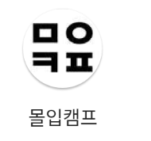
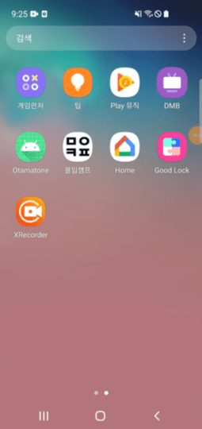
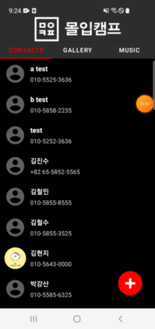
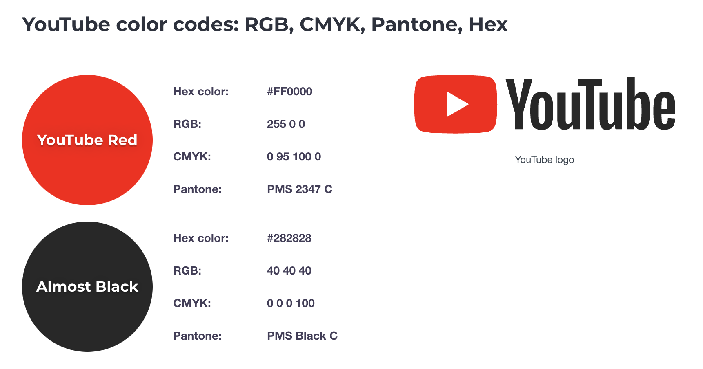

# FlowCamp1

## Week 1 assignment

Development sprint : 1 week( 21.06.30 ~ 21.07.06 )

### Library Dependency

App development using Android Studio 4.2.1

### Team

Kim HyeonJi, [Lee JeongSeok](https://www.notion.so/JEONGSEOK-LEE-eca35bb9a8be48feb92029bf2f8a3298)

## 

# Project Description

Receive the fragment adapter from the main activity and change the fragment  
Fragment Base Tab3
tab1|tab2|tab3|
---|---|---|
Contacts|Gellery|MusicPlayer|

Through contentResolver, it accesses the external database(Unique database for each mobile phone) of the mobile phone, reads data, and list up files.

Icon|inapp|
---|---|
||

---
# Detail
## Main

1. Added Flow camp image to title bar and displayed
2. Create 3 Fragment tabs through the Fragment adapter and add a function to change the tab when clicking each button or swiping left or right
3. When you slide up, a refresh effect occurs and the window is refreshed
   > - Accessing the database again to get data

## Tab Common Features

1. Sort data alphabetically
2. Access the database inside your phone and read the data

## tab1 : Contact List View

Read Contacts

1. It reads the contacts stored in the database inside the mobile phone
   > - displays the number, name, and image. The image was marked in a circle.
2. When each contact is clicked, the phone's calling function is turned on immediately to make a call possible.
3. By adding a floating action button, a dialog is output when clicked
   > - Add a name and number to a contact when inputting a name and number in text in the dialog

---

## tab2 Gellery

1. Display the image stored in the database inside the phone in grid view
   > - In this case, it is written as (n x n) according to the size of the mobile phone.
2. When click each image, the image is enlarged
   > - Click outside the enlarged image to close the image

---

## tab3 Music Play List

1. It reads the audio stored in the phone's internal database
   > - displays the title, artist, and album image.
2. When a song list is pressed, a song is played.
3. Add a play bar at the bottom.
   > - When you slide, the song resumes at the appropriate position.
   > - Read and mark the playing time and length of each song
4. Create previous song play, pause & play, next song play button
   > - Click the stop button to stop, replace the image, and the play button
   >   > - click the stop button is pressed, it resumes from the previous stop.
5. When you select Music, the music album, name, and artist are displayed at the bottom.
   > - If the curve is long, it will slowly move to the left.
6. Play music in the background, lock your phone or switch apps, and you'll see the song.

---

# Desing References in YouTube

[YouTube](https://www.youtube.com)